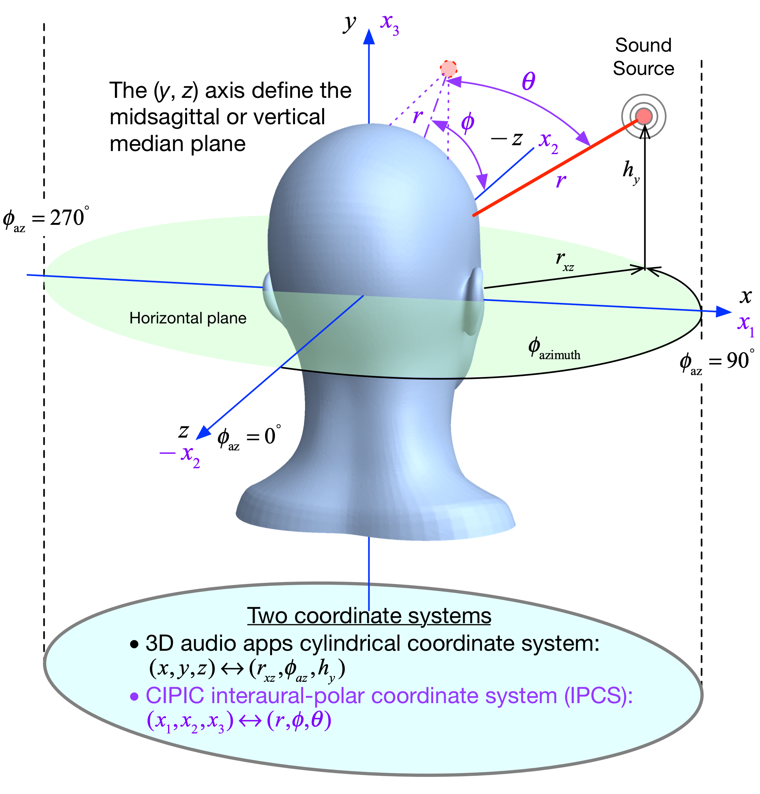
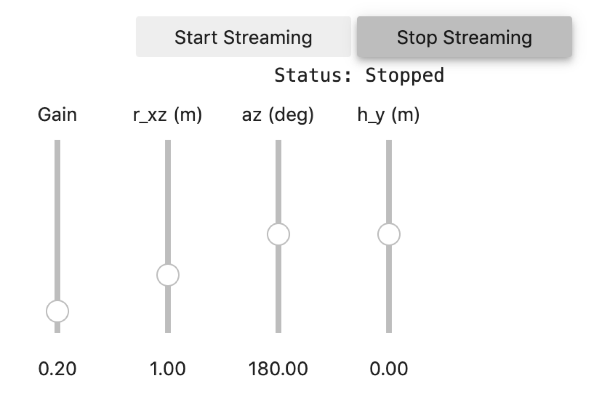
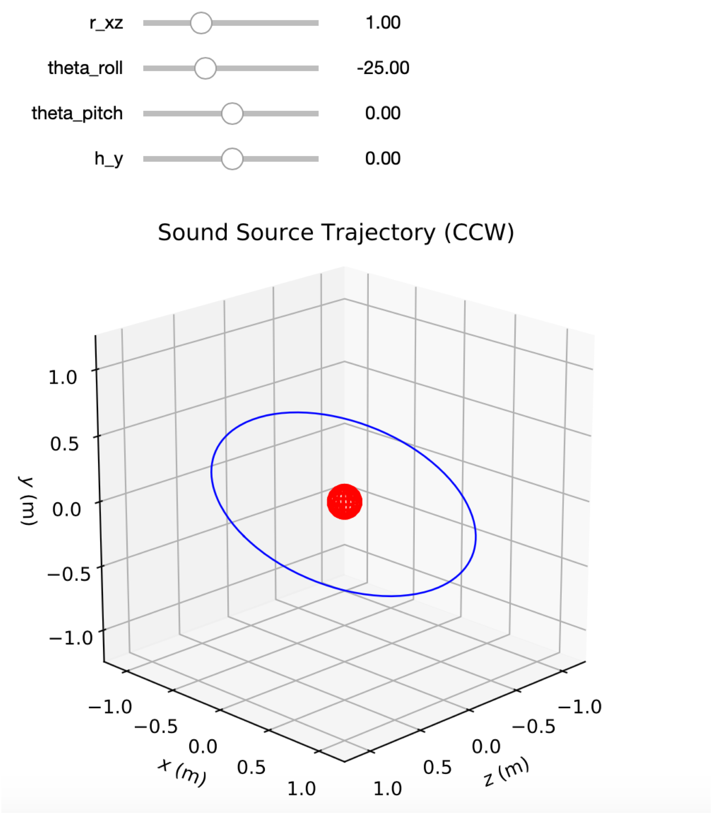
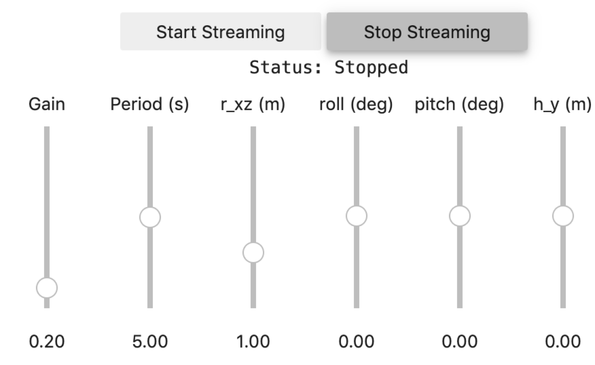

# Binaural Audio Processing Using CIPIC and CIPIC-Like Spherical Head HRIR Data Sets
This notebook contains primarily two 3D audio apps:

1. A static sound source positioned in real-time using Jupyter widget sliders
2. A dynamic sound source flying a *trajectory* with parameters controlled via Jupyter widget sliders

In both cases the basic 3D audio simulation, which makes of `pyaudio_helper` from `Scikit-DSP-Comm` takes the genral form shown below:


A simplified block diagram of PyAudio *streaming-based* (nonblocking) signal processing is shown below. The package `pyaudio` needs to be installed as the underpining to `Scikit-DSP-Comm`. 


## Notebook Imports and Configuration


```python
%pylab inline
import sk_dsp_comm.sigsys as ss
import sk_dsp_comm.pyaudio_helper as pah
import sk_dsp_comm.fir_design_helper as fir_d
import scipy.signal as signal
import scipy.io as io
from ipywidgets import interact, interactive, fixed, interact_manual
import ipywidgets as widgets
from IPython.display import Audio, display
from IPython.display import Image, SVG
```

    Populating the interactive namespace from numpy and matplotlib


### Figure Rendering Options


```python
pylab.rcParams['savefig.dpi'] = 100 # default 72
#pylab.rcParams['figure.figsize'] = (6.0, 4.0) # default (6,4)
#%config InlineBackend.figure_formats=['png'] # default for inline viewing
%config InlineBackend.figure_formats=['svg'] # SVG inline viewing
#%config InlineBackend.figure_formats=['pdf'] # render pdf figs for LaTeX
```


```python
pah.available_devices()
```

    {0: {'name': 'Built-in Microphone', 'inputs': 2, 'outputs': 0},
     1: {'name': 'Built-in Output', 'inputs': 0, 'outputs': 2}}

## A Simple Real-Time Mono Playback Test App
The case of real-time playback sends an `ndarray` through the chosen audio output path with the array data either being truncated or looped depending upon the length of the array relative to `Tsec` supplied to `stream(Tsec)`. To manage the potential looping aspect of the input array, we first make a `loop_audio` object from the input array. An example of this is shown below:


```python
# define callback (2)
# Here we configure the callback to play back a wav file                      
def callback0(in_data, frame_count, time_info, status):
    global DSP_IO, x
    DSP_IO.DSP_callback_tic()
    
    # Ignore in_data when generating output only
    #***********************************************
    # Note wav is scaled to [-1,1] so need to rescale to int16
    y = 32767*x.get_samples(frame_count)
    # Perform real-time DSP here if desired
    #
    #***********************************************
    # Save data for later analysis
    # accumulate a new frame of samples
    DSP_IO.DSP_capture_add_samples(y)
    #***********************************************
    # Convert from float back to int16
    y = y.astype(int16)
    DSP_IO.DSP_callback_toc()
    return y.tobytes(), pah.pyaudio.paContinue
```


```python
fs, x_wav2 = ss.from_wav('Music_Test.wav')
x_wav = (x_wav2[:,0] + x_wav2[:,1])/2 #combine the left and right channels
x = pah.loop_audio(x_wav)
DSP_IO = pah.DSP_io_stream(callback0,0,1,fs=44100,Tcapture=0)
DSP_IO.interactive_stream(0)
```


## Mapping to the CIPIC Interaural Polar Coordinates

CIPIC uses a special *interaural polar coordinate system* (IPCS) that needs to be addressed in order to make a 3D audio demo. Two other aspects to be consider are:

1. CIPIC assumes the sound source lies on a sphere of radius 1m, so due to sound wave divergence, the amplitude needs to be scaled inversely with radial distance (inverse-squared in the sound intensity sense).
2. To properly represent a sound source closer than 1m there is a parallax error that must be dealt with as explained in [Fitzpatrick].

The ultimate goal is to represent an audio source arriving from any set of coordinates, in this case $(x_1,y_1,z_1)$. 


```python
class ss_mapping2CIPIChrir(object):
    """
    A class for sound source mapping to the CIPIC HRIR database
    
    CIPIC uses the interaural polar coordinate system (IPCS).
    The reference sphere for the head-related transfer function 
    (HRTF) measurements/head-related impulse response (HRIR) 
    measurements has a 1m radius.
    
    
    Mark Wickert June 2018
    """
    
    def __init__(self,sub_foldername,head_radius_cm = 8):
        """
        Object instantiation
        
        The default head radius is 8cm or 0.08m
        """
        # Store the head radius in meters
        self.head_radius = head_radius_cm/100
        
        # Store the HRIR 200 tap FIR filter coefficient sets
        self.subject = sub_foldername
        hrir_LR = io.loadmat( self.subject + '/hrir_final.mat')
        self.hrirL = hrir_LR['hrir_l']
        self.hrirR = hrir_LR['hrir_r']
        
        # Create LUTs for the azimuth and elevation 
        # values. This will make it easy to quantize
        # a given source location to one of the 
        # available HRIRs in the database.
        self.Az_LUT = hstack(([-80,-65,-55],
                      arange(-45,45+5,5.0),[55,65,80]))
        self.El_LUT = -45 + 5.625*arange(0,50)
        
        # Initialize parameters
        self.tR = 1 # place source on unit sphere
        self.tL = 1 # directly in front of listener
        self.elRL = 0
        self.azR = 0
        self.azL = 0
        self.AzR_idx = 0
        self.AzL_idx = 0
        self.ElRL_idx = 0
        
        # Store corresponding right and left ear FIR 
        # filter coefficients
        self.coeffR = self.hrirR[0,0,:]
        self.coeffL = self.hrirL[0,0,:]
        
    
    def cart2ipcs(self,x,y,z):
        """
        Map cartesian source coordinates (x,y,z) to the 
        CIPIC interaural polar coordinate system (IPCS) 
        for easy access to CIPIC HRIR. Parallax error is 
        also dealt with so two azimuth values are found. 
        To fit IPCS the cartesian coordinates are defined 
        as follows:

        (0,0,0) <--> center of head.
        (1,0,0) <--> unit vector pointing outward from the right 
                     on a line passing from left to right through
                     the left and right ear (pinna) ear canals
        (0,1,0) <--> unit vector pointing out through the top 
                     of the head.
        (0,0,1) <--> unit vector straight out through the back of 
                     the head, such that a right-handed coordinate
                     system is formed.

        Mark Wickert June 2018
        """
        # First solve for the parameter t, which is used to describe 
        # parametrically the location of the source at (x1,y1,z1) on a line 
        # connecting the right or left ear canal entry point to the 
        # unit sphere.

        # The right ear (pinna) solution
        aR = (x-self.head_radius)**2 + y**2 + z**2
        bR = 2*self.head_radius*(x-self.head_radius)
        cRL = self.head_radius**2 - 1
        # The left ear (pinna) solution
        aL = (x+self.head_radius)**2 + y**2 + z**2
        bL = -2*self.head_radius*(x+self.head_radius)

        # Find the t values which are also the gain values 
        # to be applied to the filter.
        self.tR = max((-bR+sqrt(bR**2-4*aR*cRL))/(2*aR),
                 (-bR-sqrt(bR**2-4*aR*cRL))/(2*aR))
        self.tL = max((-bL+sqrt(bL**2-4*aL*cRL))/(2*aL),
                 (-bL-sqrt(bL**2-4*aL*cRL))/(2*aL))
        #print('tR = %6.2e, tL = %6.2e' % (self.tR,self.tL))
        elRL = 180/pi*arctan2(y,-z)
        if elRL < -90:
            elRL += 360
        self.elRL = elRL
        self.azR = 180/pi*arcsin(clip(self.head_radius \
                                 + self.tR*(x-self.head_radius),-1,1))
        self.azL = 180/pi*arcsin(clip(-self.head_radius \
                                 + self.tL*(x+self.head_radius),-1,1))
        #print('elRL = %4.2f, azR = %4.2f, azL = %4.2f' \
        #      % (self.elRL,self.azR,self.azL))
        
        self.AzR_idx = argmin((self.Az_LUT - self.azR)**2)
        self.AzL_idx = argmin((self.Az_LUT - self.azL)**2)
        self.ElRL_idx = argmin((self.El_LUT - self.elRL)**2)
        self.coeffR = self.hrirR[self.AzR_idx,self.ElRL_idx,:]
        self.coeffL = self.hrirL[self.AzL_idx,self.ElRL_idx,:]
```

### Overlay Plot of the Right and Left Ear Impulse Responses versus Source Location
The next code cell creates an interactive plot of the right and left channel HRIR as a function of the source location in the cylindical coordinates shown below: 



In this repository two subject HRIR data sets are provided, `subject_200` and `subject_201`. These subjects correspond to simple spherical head models. The explanation of these data sets can be found in the notebook: `CIPIC_read_write.ipynb`. To explore ture human subject HRIR data sets you need to visit the CIPIC site: https://www.ece.ucdavis.edu/cipic/spatial-sound/hrtf-data/. In particular at from this site you can download a [ZIP](https://ucdavis.app.box.com/s/wrxylwv65q4ll69xri89pduhd4w4coqr) file that contains data sets for 45 subjects that were obtaine in an anechoic chamber. A good starting point is the folder `subject_165`, for the manikin KEMAR (https://www.gras.dk/industries/audiology/kemar).


```python
subject = ss_mapping2CIPIChrir('subject_200') # subject_165 or subject_200
@interact(p_theta = widgets.IntSlider(min=0,max=360,step=5,value=90),
          p_r = widgets.FloatSlider(min=0.1,max=4,step=0.1,value=1),
          p_y = widgets.FloatSlider(min=-5,max=5,step=0.1,value=0.0))
def f(p_theta,p_r,p_y):
    subject.cart2ipcs(p_r*sin(pi/180*p_theta),
                      p_y,
                      p_r*cos(pi/180*p_theta))
    
    t = arange(0,200)/44.100
    plot(subject.tR*subject.coeffR) # /1.5
    plot(subject.tL*subject.coeffL) # /1.5
    title(r'Head-Related Impulse Response versus Source Location')
    ylabel(r'Amplitude')
    xlabel(r'Time (ms)')
    legend((r'Right',r'Left'))
    ylim([-1.4,1.4])
    grid();
    #savefig('hrir_130_R875.pdf')
```


```python
r_xz_plane = widgets.FloatSlider(description = 'r_xz (m)', 
             continuous_update = True,
             value = 1.0, # At one meter away
             min = 0.2, 
             max = 3.0, 
             step = 0.05, 
             orientation = 'vertical')

azimuth = widgets.FloatSlider(description = 'az (deg)', 
          continuous_update = True,
          value = 180.0, # In front
          min = 0.0, 
          max = 360, 
          step = 5, 
          orientation = 'vertical')

y_axis = widgets.FloatSlider(description = 'h_y (m)', 
          continuous_update = True,
          value = 0.0, # Level with ears (pinna)
          min = -5.0, 
          max = 5.0, 
          step = 0.05, 
          orientation = 'vertical')

Gain = widgets.FloatSlider(description = 'Gain', 
        continuous_update = True,
        value = 0.2,
        min = 0.0, 
        max = 2.0, 
        step = 0.01, 
        orientation = 'vertical')

#widgets.HBox([Gain,r_xz_plane,azimuth,y_axis])
```


```python
def callback(in_data, frame_length, time_info, status):
    global DSP_IO,subject,zi_left,zi_right,r_xz_plane
    global azimuth,y_axis,Gain,x_loop
    DSP_IO.DSP_callback_tic()
    # convert byte data to ndarray
    in_data_nda = np.frombuffer(in_data, dtype=np.int16)
    # separate left and right data
    x_left,x_right = DSP_IO.get_LR(in_data_nda.astype(float32))    
    #***********************************************
    # DSP operations here:
    # Apply Kemar HRIR left and right channel filters at
    # the sound source location in cylindrical coordinates
    # mapped to cartesian coordinates
    # The input to both filters comes by first 
    # combining x_left & x_right channels
#     x_mono = Gain.value*(x_left + x_right)/2
#     x_mono = Gain.value*20000*x_loop.get_samples(frame_length)
    x_mono = Gain.value*5000*randn(frame_length) #input white noise
    subject.cart2ipcs(r_xz_plane.value*sin(pi/180*azimuth.value), #x
                      y_axis.value, #y
                      r_xz_plane.value*cos(pi/180*azimuth.value)) #z 
    y_left, zi_left = signal.lfilter(subject.coeffL,1,
                                     subject.tL*x_mono,zi=zi_left) 
    y_right, zi_right = signal.lfilter(subject.coeffR,1,
                                       subject.tR*x_mono,zi=zi_right)
    #***********************************************
    # Pack left and right data together
    y = DSP_IO.pack_LR(y_left,y_right)   
    #***********************************************
    # Save data for later analysis
    # accumulate a new frame of samples
    DSP_IO.DSP_capture_add_samples_stereo(y_left,y_right)
    #***********************************************
    # Convert from float back to int16
    y = y.astype(int16)
    DSP_IO.DSP_callback_toc()
    # Convert ndarray back to bytes
    return y.tobytes(), pah.pyaudio.paContinue
```


```python
# Create a ss_mapping2CIPIChrir object
# SUBJECT 20, 21 (KEMAR sm), & 165 (KEMAR LG) available now
# subject_200, 201 is 8.75 cm, 10 cm sphere
subject = ss_mapping2CIPIChrir('subject_200')
# Initialize L/R filter initial conditions
zi_left = signal.lfiltic(subject.coeffL,1,[0])
zi_right = signal.lfiltic(subject.coeffR,1,[0])
# Load loop audio as a single channel/mono source
fs, x_wav_mt = ss.from_wav('Music_Test.wav')
x_wav_mt = (x_wav_mt[:,0] + x_wav_mt[:,1])/2
x_loop = pah.loop_audio(x_wav_mt)
# Create a IO stream object and start streaming
DSP_IO = pah.DSP_io_stream(callback,0,1,frame_length=1024, 
                           fs=44100,Tcapture=0)
DSP_IO.interactive_stream(0,2)
widgets.HBox([Gain,r_xz_plane,azimuth,y_axis])
```




### Moving the Sound Source Over a Trajectory


```python
def snd_orbit(phi,r_xy,theta_roll,theta_pitch,h_y):
    """
    xrp,yrp,zrp = snd_orbit(T0,r_xy,theta_roll,theta_yaw)
    
    Mark Wickert June 2018
    """
    # Increment phi using a state variable
    z = r_xy*cos(phi*pi/180)
    x = r_xy*sin(phi*pi/180)
    if type(phi) == numpy.ndarray:
        y = zeros(len(phi))
    else:
        y = 0

    # Roll: x-y plane rotation
    zr = z
    xr = x*cos(theta_roll*pi/180) - y*sin(theta_roll*pi/180)
    yr = x*sin(theta_roll*pi/180) + y*cos(theta_roll*pi/180)

    # Pitch: y-z plane rotation
    zrp = yr*sin(theta_pitch*pi/180) + zr*cos(theta_pitch*pi/180)
    xrp = xr
    yrp = yr*cos(theta_pitch*pi/180) - zr*sin(theta_pitch*pi/180)
    yrp = yrp + h_y
    return xrp, yrp, zrp
```


```python
@interact(r_xz = widgets.FloatSlider(min=0.1,max=3,step=.1,value=1),
          theta_roll = widgets.FloatSlider(min=-80,max=80,step=5.0,value=0),
          theta_pitch = widgets.FloatSlider(min=-80,max=80,step=5.0,value=0),
          h_y = widgets.FloatSlider(min=-3,max=3,step=.2,value=0))
def traj_plot(r_xz,theta_roll,theta_pitch,h_y):
    from mpl_toolkits.mplot3d import Axes3D
    fig = plt.figure(figsize=(6,6))
    ax = fig.add_subplot(111, projection='3d')
    #ax.set_aspect('equal')
    
    u, v = np.mgrid[0:2*np.pi:20j, 0:np.pi:10j]
    x = .12*np.cos(u)*np.sin(v)
    y = .12*np.sin(u)*np.sin(v)
    z = .12*np.cos(v)
    ax.plot_wireframe(x, y, z, color="r")
    
    phi = arange(0,361,1)
    xrp, yrp, zrp = snd_orbit(phi,r_xz,theta_roll,theta_pitch,h_y)
    ax.plot(zrp,xrp,yrp,'b',linewidth=1.0)

    ax.set_xlim3d(-1.2,1.2)
    ax.set_ylim3d(-1.2,1.2)
    ax.set_zlim3d(-1.2,1.2)
    ax.set_xlabel(r'$z$ (m)')
    ax.set_ylabel(r'$x$ (m)')
    ax.set_zlabel(r'$y$ (m)')
    ax.set_title(r'Sound Source Trajectory (CCW)')
    ax.set_aspect('equal')
    #axis('scaled')
    ax.view_init(elev = 20, azim = 45)
    plt.show()
```




```python
r_xz_T = widgets.FloatSlider(description = 'r_xz (m)', 
                continuous_update = True,
                value = 1.0, # At one meter away
                min = 0.2, 
                max = 3.0, 
                step = 0.05, 
                orientation = 'vertical')

theta_roll_T = widgets.FloatSlider(description = 'roll (deg)', 
                continuous_update = True,
                value = 0.0, # In front
                min = -80.0, 
                max = 80.0, 
                step = 5, 
                orientation = 'vertical')

theta_pitch_T = widgets.FloatSlider(description = 'pitch (deg)', 
                continuous_update = True,
                value = 0.0, # In front
                min = -80.0, 
                max = 80.0, 
                step = 5, 
                orientation = 'vertical')

h_y_T = widgets.FloatSlider(description = 'h_y (m)', 
                continuous_update = True,
                value = 0.0, # Level with ears (pinna)
                min = -5.0, 
                max = 5.0, 
                step = 0.05, 
                orientation = 'vertical')

Gain_T = widgets.FloatSlider(description = 'Gain', 
                continuous_update = True,
                value = 0.2,
                min = 0.0, 
                max = 2.0, 
                step = 0.01, 
                orientation = 'vertical')

Period_T = widgets.FloatSlider(description = 'Period (s)', 
                continuous_update = True,
                value = 5,
                min = 0.1, 
                max = 10, 
                step = 0.1, 
                orientation = 'vertical')

phi_T = 0
#widgets.HBox([Gain_T,Period_T,r_xz_T,theta_roll_T,theta_pitch_T,h_y_T])
```


```python
def callbackTraj(in_data, frame_length, time_info, status):
    global DSP_IO,subject,zi_left,zi_right, phi_T, x_loop
    global Gain_T,Period_T,r_xz_T,theta_roll_T,theta_pitch_T,h_y_T
    DSP_IO.DSP_callback_tic()
    # convert byte data to ndarray
    in_data_nda = np.frombuffer(in_data, dtype=np.int16)
    # separate left and right data
    x_left,x_right = DSP_IO.get_LR(in_data_nda.astype(float32))    
    #***********************************************
    # Trajectory phase (rad)
    Dphi = 1/Period_T.value*2*pi*frame_length/44100
    # DSP operations here:
    # Apply Kemar HRIR left and right channel filters at
    # the sound source location in cylindrical coordinates
    # mapped to cartesian coordinates
    # The input to both filters comes by first 
    # combining x_left & x_right channels
#     x_mono = Gain_T.value*(x_left + x_right)/2
    x_mono = Gain_T.value*20000*x_loop.get_samples(frame_length)
#     x_mono = Gain_T.value*5000*randn(frame_length) #input white noise
    x, y, z = snd_orbit(phi_T*180/pi,r_xz_T.value,theta_roll_T.value,
                        theta_pitch_T.value,h_y_T.value)
    subject.cart2ipcs(x,y,z)
#     subject.cart2ipcs(0,0,-1)
    y_left, zi_left = signal.lfilter(subject.coeffL,1,
                                     subject.tL*x_mono,zi=zi_left) 
    y_right, zi_right = signal.lfilter(subject.coeffR,1,
                                       subject.tR*x_mono,zi=zi_right)
    #***********************************************
    # Pack left and right data together
    y = DSP_IO.pack_LR(y_left,y_right)
    # Typically more DSP code here     
    #***********************************************
    # Save data for later analysis
    # accumulate a new frame of samples
    DSP_IO.DSP_capture_add_samples_stereo(y_left,y_right)
    #***********************************************
    phi_T = mod(phi_T+Dphi,2*pi)
    # Convert from float back to int16
    y = y.astype(int16)
    DSP_IO.DSP_callback_toc()
    # Convert ndarray back to bytes
    return y.tobytes(), pah.pyaudio.paContinue
```


```python
# Create a ss_mapping2CIPIChrir object
# SUBJECT 20, 21 (KEMAR sm), & 165 (KEMAR LG) available now
subject = ss_mapping2CIPIChrir('subject_200')
# Initialize L/R filter initial conditions
zi_left = signal.lfiltic(subject.coeffL,1,[0])
zi_right = signal.lfiltic(subject.coeffR,1,[0])
# Load loop audio
fs, x_wav_mt = ss.from_wav('Music_Test.wav')
x_wav_mt = (x_wav_mt[:,0] + x_wav_mt[:,1])/2
x_loop = pah.loop_audio(x_wav_mt)
# Create a IO stream object and start streaming
DSP_IO = pah.DSP_io_stream(callbackTraj,0,1,frame_length=1024, 
                           fs=44100,Tcapture=0)
DSP_IO.interactive_stream(0,2)
widgets.HBox([Gain_T,Period_T,r_xz_T,theta_roll_T,theta_pitch_T,h_y_T])
```



